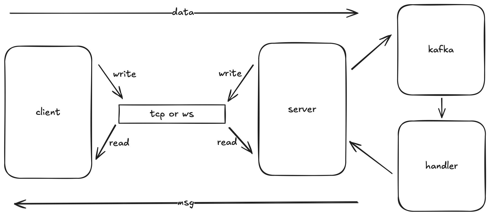

# kafka-im

## 介绍

客户端通过TCP/WebSocket与服务端建立长链接，服务端接收消息后对消息进行处理后投递到用户channel，
客户端的写goroutine监听标准输入，读goroutine监听长链接，
服务端每个用户的的写goroutine监听channel，读goroutine监听长链接

## ToDo
+ 加入kafka作为服务端接收消息和处理消息的中间件
+ 在处理消息阶段接入大模型对消息校验

## 开始
0.相关库
```
go get github.com/gorilla/websocket 
go get github.com/google/uuid       
go get github.com/sirupsen/logrus   
```
1.启动服务端
```
go test -run Test_TcpServer ./example   // tcp server
go test -run Test_WsServer ./example    // websocket server
```
2.启动客户端
```
go run main.go -net="tcp"   // tcp client
go run main.go -net="ws"    // websocket client
```
3.消息格式
```
[userId] message    // 私信
[*] message         // 广播
```

## 架构


## 注意
```
// 向websocket写有两种方式

// 第一种
err := conn.(*websocket.Conn).WriteMessage(websocket.TextMessage, byteStream)

// 第二种
w, err := user.connWs.NextWriter(websocket.TextMessage)
w.Write(dataStream)
err = w.Close()     //  必须要Close！
```

## 联系
`lirity1024@outlook.com`